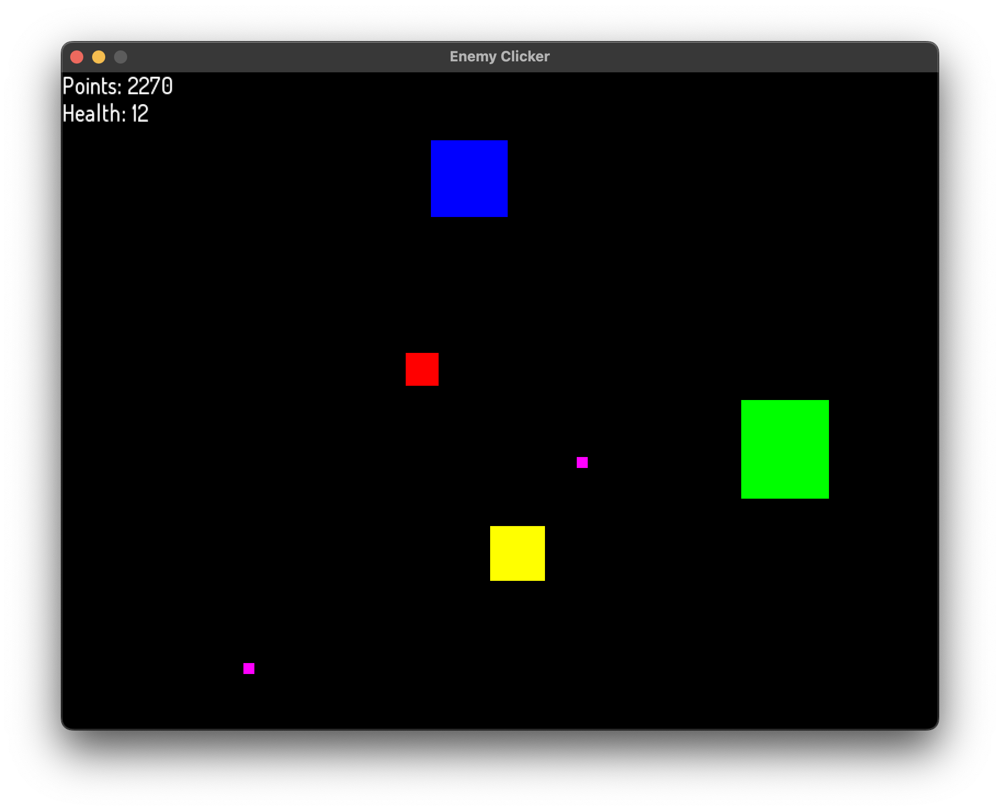

# OOP Project - Enemy Clicker Game

This is a simple 2D game built for practicing object-oriented programming (OOP) principles. The game is developed in C++ using the SFML (Simple and Fast Multimedia Library). 

The game involves spawning enemies of different types, which the player can interact with by clicking on them to gain points. The game ends when the player's health reaches zero.

## Features

- **Game Engine**: Custom game engine implemented in C++.
- **Enemy Spawning**: Enemies of different sizes and colors spawn randomly.
- **Mouse Interaction**: Click on enemies to gain points.
- **Health System**: Lose health when enemies pass the bottom of the screen.
- **UI**: Displays points and health in real-time.

## Project Structure

- **`src/`**: Contains the source code for the game.
- **`resources/fonts/`**: Includes font files used in the game.
- **`resources/images/`**: Contains a screenshot of the game.
- **`.vscode/`**: Configuration files for Visual Studio Code.
- **`bin/`**: Output directory for the compiled binary.

Files in the `src/` directory:
- **`main.cpp`**: Entry point of the game.
- **`Game.cpp`**: Contains the main game loop and game logic.

